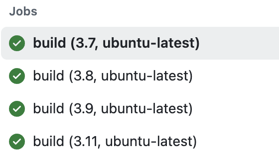

This is my fourth mini project for the IDS 706 

# **Purpose**
The purpose of this project is to test multiple Python versions and environments in GitHub Actions. I use the **Students Performance Factors** dataset from Kaggle, which contains information about factors that can influence student grades. The main goal is to automate the generation of descriptive statistics and visualizations using **Polars** in different Python environments.

I use the **setup-python action** in conjunction with the matrix strategy to run multiple jobs with different configurations. This includes analyzing the dataset to check the operating system and Python version compatibility.

# **Preparation**
1. Open Codespaces or your preferred development environment.
2. Wait for the container to be built and the virtual environment to be activated with `requirements.txt` installed.
3. Make changes to any parts of the code (`main.py` or  `test_main.py`).
4. Push to see code testing in different operating systems and Python environments using GitHub Actions.

# **GitHub Actions with Matrix Strategy**

The GitHub Actions workflow is configured to use a matrix strategy to test the project in multiple environments. Here’s a snapshot of the jobs:

- **Operating Systems:** `ubuntu-latest`, `windows-latest`
- **Python Versions:** 3.7, 3.8, 3.9, 3.11

